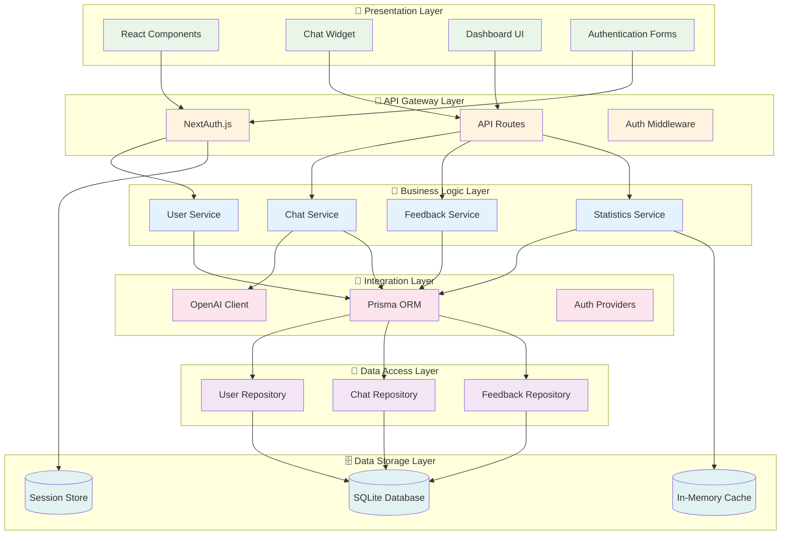
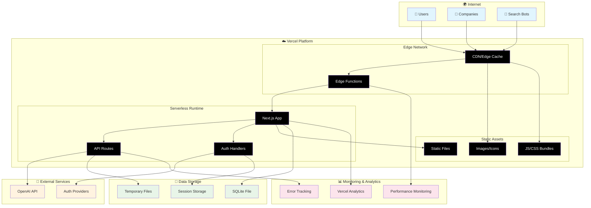
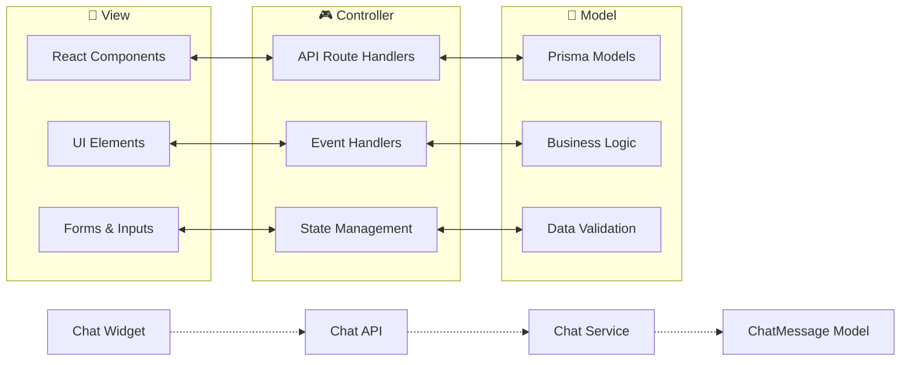
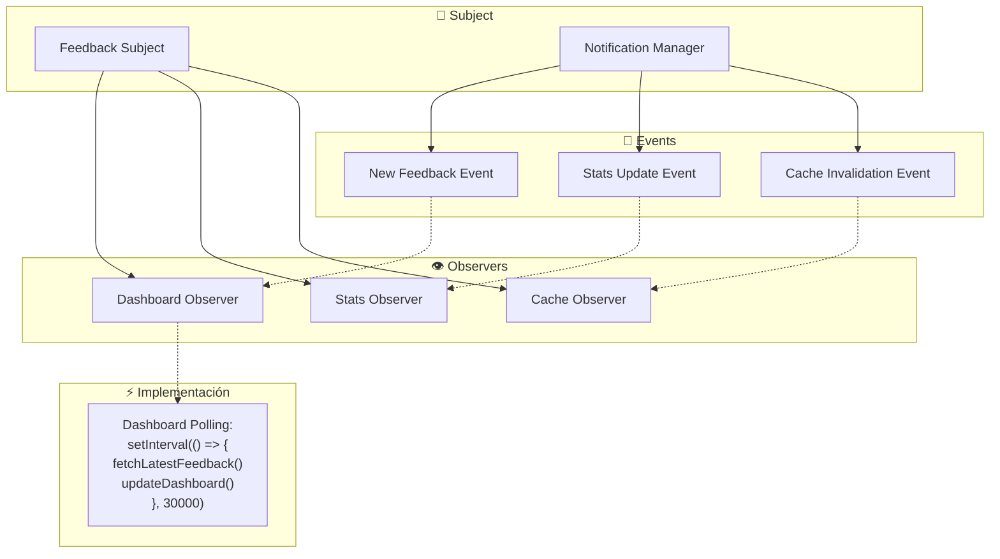
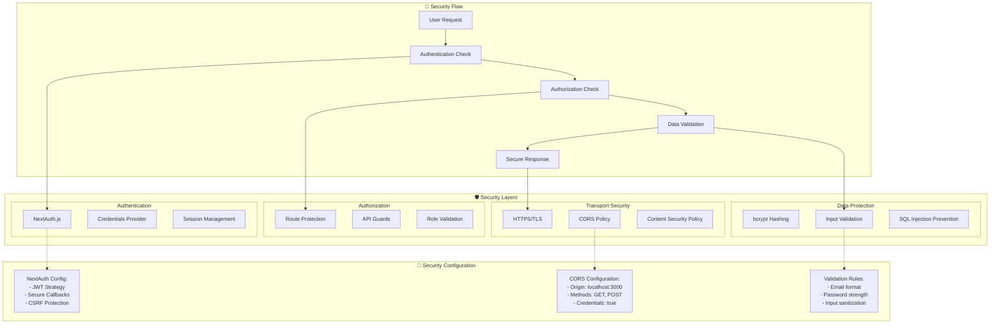
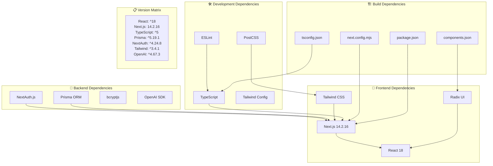

# Diagramas de Arquitectura del Sistema
## MiniMagneto - Análisis Arquitectónico

### Introducción
Este documento presenta diferentes vistas arquitectónicas del sistema MiniMagneto, incluyendo arquitectura de componentes, capas, despliegue y patrones de diseño implementados.

---

## 1. Arquitectura de Capas (Layered Architecture)



---

## 2. Arquitectura de Componentes (Component Architecture)

```mermaid
graph TB
    subgraph "🌐 Frontend Components"
        subgraph "Pages"
            HomePage[page.tsx]
            EmpleosPage[empleos/page.tsx]
            EmpresasPage[empresas/page.tsx]
        end
        
        subgraph "Components"
            AuthModal[auth-modal.tsx]
            ChatWidget[chat-widget.tsx]
            UserMenu[user-menu.tsx]
            ThemeProvider[theme-provider.tsx]
        end
        
        subgraph "UI Components"
            Button[button.tsx]
            Card[card.tsx]
            Input[input.tsx]
            Badge[badge.tsx]
        end
    end
    
    subgraph "⚙️ Backend Services"
        subgraph "API Routes"
            AuthAPI[/api/auth/*]
            ChatAPI[/api/chat]
            FeedbackAPI[/api/feedback]
            StatsAPI[/api/stats]
        end
        
        subgraph "Core Services"
            AuthService[Authentication Service]
            ChatProcessor[Chat Processor]
            FeedbackAnalyzer[Feedback Analyzer]
            StatsCalculator[Stats Calculator]
        end
    end
    
    subgraph "🔌 External Integrations"
        OpenAI[OpenAI API]
        NextAuthCore[NextAuth Core]
        PrismaORM[Prisma ORM]
    end
    
    subgraph "💾 Data Layer"
        UserModel[User Model]
        ChatModel[Chat Models]
        JobModel[Job Model]
        StatsModel[Stats Model]
        Database[(SQLite DB)]
    end
    
    %% Relaciones Frontend
    HomePage --> AuthModal
    HomePage --> ChatWidget
    EmpleosPage --> ChatWidget
    EmpresasPage --> UserMenu
    
    AuthModal --> Button
    AuthModal --> Input
    ChatWidget --> Card
    UserMenu --> Badge
    
    %% Relaciones API
    AuthModal -.-> AuthAPI
    ChatWidget -.-> ChatAPI
    EmpresasPage -.-> FeedbackAPI
    EmpresasPage -.-> StatsAPI
    
    %% Relaciones Backend
    AuthAPI --> AuthService
    ChatAPI --> ChatProcessor
    FeedbackAPI --> FeedbackAnalyzer
    StatsAPI --> StatsCalculator
    
    %% Relaciones Externas
    AuthService --> NextAuthCore
    ChatProcessor --> OpenAI
    AuthService --> PrismaORM
    ChatProcessor --> PrismaORM
    FeedbackAnalyzer --> PrismaORM
    StatsCalculator --> PrismaORM
    
    %% Relaciones Datos
    PrismaORM --> UserModel
    PrismaORM --> ChatModel
    PrismaORM --> JobModel
    PrismaORM --> StatsModel
    
    UserModel --> Database
    ChatModel --> Database
    JobModel --> Database
    StatsModel --> Database
```

---

## 3. Arquitectura de Despliegue (Deployment Architecture)



---

## 4. Patrones de Diseño Implementados

### 4.1 Patrón MVC (Model-View-Controller)



### 4.2 Patrón Repository

```mermaid
graph TB
    subgraph "🔧 Service Layer"
        UserService[User Service]
        ChatService[Chat Service]
        FeedbackService[Feedback Service]
    end
    
    subgraph "📚 Repository Layer"
        UserRepository[User Repository]
        ChatRepository[Chat Repository]
        FeedbackRepository[Feedback Repository]
    end
    
    subgraph "💾 Data Access"
        PrismaClient[Prisma Client]
        QueryBuilder[Query Builder]
        Transactions[Transaction Manager]
    end
    
    %% Implementación del patrón
    UserService --> UserRepository
    ChatService --> ChatRepository
    FeedbackService --> FeedbackRepository
    
    UserRepository --> PrismaClient
    ChatRepository --> PrismaClient
    FeedbackRepository --> PrismaClient
    
    PrismaClient --> QueryBuilder
    PrismaClient --> Transactions
    
    %% Ejemplo de implementación
    subgraph "Ejemplo: Chat Repository"
        CreateMessage[createMessage()]
        FindByThread[findByThread()]
        UpdateFeedback[updateFeedback()]
        CountByCompany[countByCompany()]
    end
    
    ChatRepository --> CreateMessage
    ChatRepository --> FindByThread
    ChatRepository --> UpdateFeedback
    ChatRepository --> CountByCompany
```

### 4.3 Patrón Strategy (para Feedback Detection)

```mermaid
graph TB
    subgraph "🎯 Context"
        FeedbackAnalyzer[Feedback Analyzer]
    end
    
    subgraph "📋 Strategy Interface"
        IFeedbackStrategy[IFeedbackStrategy]
    end
    
    subgraph "🔍 Concrete Strategies"
        KeywordStrategy[Keyword Strategy]
        RatingStrategy[Rating Strategy]
        SentimentStrategy[Sentiment Strategy]
        CombinedStrategy[Combined Strategy]
    end
    
    %% Relaciones del patrón
    FeedbackAnalyzer --> IFeedbackStrategy
    IFeedbackStrategy <|-- KeywordStrategy
    IFeedbackStrategy <|-- RatingStrategy
    IFeedbackStrategy <|-- SentimentStrategy
    IFeedbackStrategy <|-- CombinedStrategy
    
    %% Implementación actual
    subgraph "💡 Implementación Actual"
        DetectFeedback["`detectFeedback(message, rating):
        1. Check keywords ['excelente', 'bueno', 'malo']
        2. Validate rating > 0
        3. Return feedback flag`"]
    end
    
    FeedbackAnalyzer -.-> DetectFeedback
```

### 4.4 Patrón Observer (para Dashboard Updates)



---

## 5. Arquitectura de Seguridad



---

## 6. Arquitectura de Performance

```mermaid
graph TB
    subgraph "⚡ Performance Optimizations"
        subgraph "Frontend Optimizations"
            LazyLoading[Lazy Loading Components]
            CodeSplitting[Code Splitting]
            ImageOptimization[Image Optimization]
            Caching[Browser Caching]
        end
        
        subgraph "Backend Optimizations"
            APIResponseCache[API Response Caching]
            DatabaseIndexes[Database Indexes]
            QueryOptimization[Query Optimization]
            ConnectionPooling[Connection Pooling]
        end
        
        subgraph "Network Optimizations"
            CDNDelivery[CDN Delivery]
            Compression[Gzip Compression]
            HTTP2[HTTP/2 Support]
            EdgeCaching[Edge Caching]
        end
    end
    
    subgraph "📊 Performance Metrics"
        LCP[Largest Contentful Paint < 2.5s]
        FID[First Input Delay < 100ms]
        CLS[Cumulative Layout Shift < 0.1]
        TTFB[Time to First Byte < 800ms]
    end
    
    %% Relaciones de optimización
    LazyLoading --> LCP
    CodeSplitting --> LCP
    APIResponseCache --> TTFB
    CDNDelivery --> TTFB
    ImageOptimization --> CLS
    DatabaseIndexes --> FID
    
    %% Implementación específica
    subgraph "🎯 Current Implementation"
        NextJSOptimizations["`Next.js Built-in:
        - Automatic code splitting
        - Image optimization
        - Static generation
        - API route caching`"]
        
        PrismaOptimizations["`Prisma Optimizations:
        - Query batching
        - Connection pooling
        - Index usage
        - Query analysis`"]
    end
    
    CodeSplitting -.-> NextJSOptimizations
    QueryOptimization -.-> PrismaOptimizations
```



---

## 7. Diagrama de Dependencias



Esta documentación arquitectónica proporciona una visión completa de cómo está estructurado el sistema MiniMagneto desde múltiples perspectivas, facilitando el mantenimiento, escalabilidad y comprensión del sistema para desarrolladores y stakeholders.