# Diagramas de Comportamiento del Sistema
## MiniMagneto - Análisis Dinámico

### Resumen
Este documento presenta los diagramas de comportamiento que muestran la interacción dinámica entre los componentes del sistema MiniMagneto, incluyendo diagramas de secuencia, estados, actividades y casos de uso.

---

## 1. Diagrama de Casos de Uso

### Actores del Sistema:
- **Candidato/Usuario**: Persona que busca empleo
- **Empresa**: Organización que publica empleos
- **Asistente IA**: Sistema automatizado de chat
- **Administrador**: Gestor del sistema

### Casos de Uso Principales:

```mermaid
graph TD
    %% Actores
    U[👤 Usuario/Candidato]
    E[🏢 Empresa]
    AI[🤖 Asistente IA]
    A[👨‍💼 Administrador]
    
    %% Sistema
    S[Sistema MiniMagneto]
    
    %% Casos de Uso Usuario
    U --> |registrarse| CU1[Registro Usuario]
    U --> |iniciar sesión| CU2[Autenticación]
    U --> |buscar empleos| CU3[Búsqueda Empleos]
    U --> |chatear con IA| CU4[Chat Asistente]
    U --> |dar feedback| CU5[Evaluar Empresa]
    
    %% Casos de Uso Empresa
    E --> |acceder dashboard| CU6[Dashboard Empresarial]
    E --> |ver estadísticas| CU7[Consultar Métricas]
    E --> |gestionar empleos| CU8[Gestión Empleos]
    
    %% Casos de Uso IA
    AI --> |responder consultas| CU9[Procesamiento Chat]
    AI --> |detectar feedback| CU10[Análisis Sentimientos]
    
    %% Casos de Uso Admin
    A --> |gestionar contenido| CU11[Administración]
    A --> |monitorear sistema| CU12[Supervisión]
    
    %% Relaciones con el sistema
    CU1 --> S
    CU2 --> S
    CU3 --> S
    CU4 --> S
    CU5 --> S
    CU6 --> S
    CU7 --> S
    CU8 --> S
    CU9 --> S
    CU10 --> S
    CU11 --> S
    CU12 --> S
```

---

## 2. Diagramas de Secuencia

### 2.1 Secuencia: Registro y Autenticación de Usuario

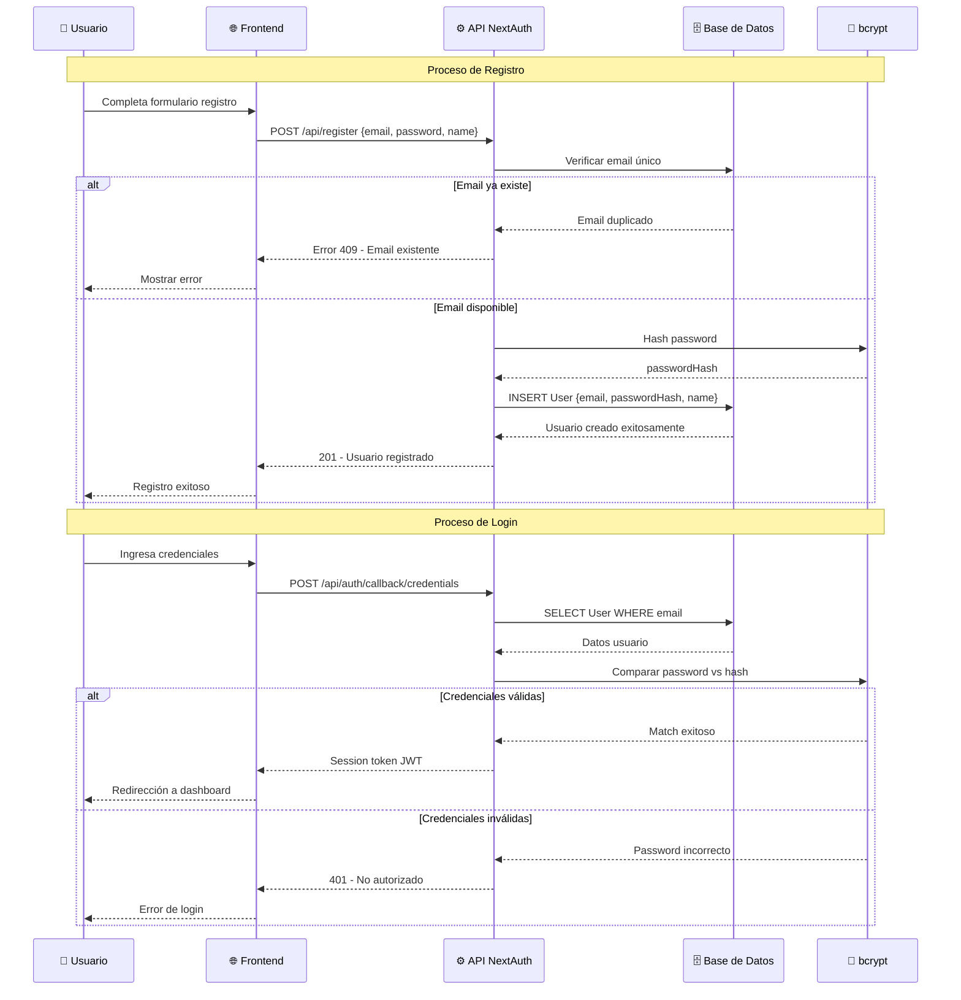

### 2.2 Secuencia: Chat con IA y Feedback

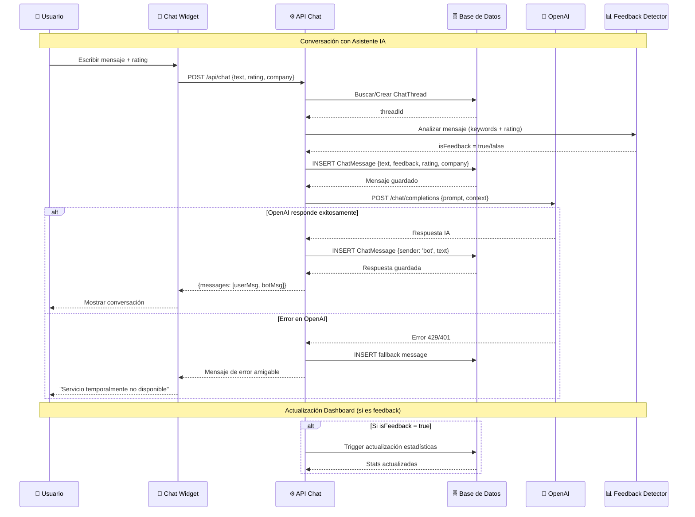

### 2.3 Secuencia: Dashboard Empresarial

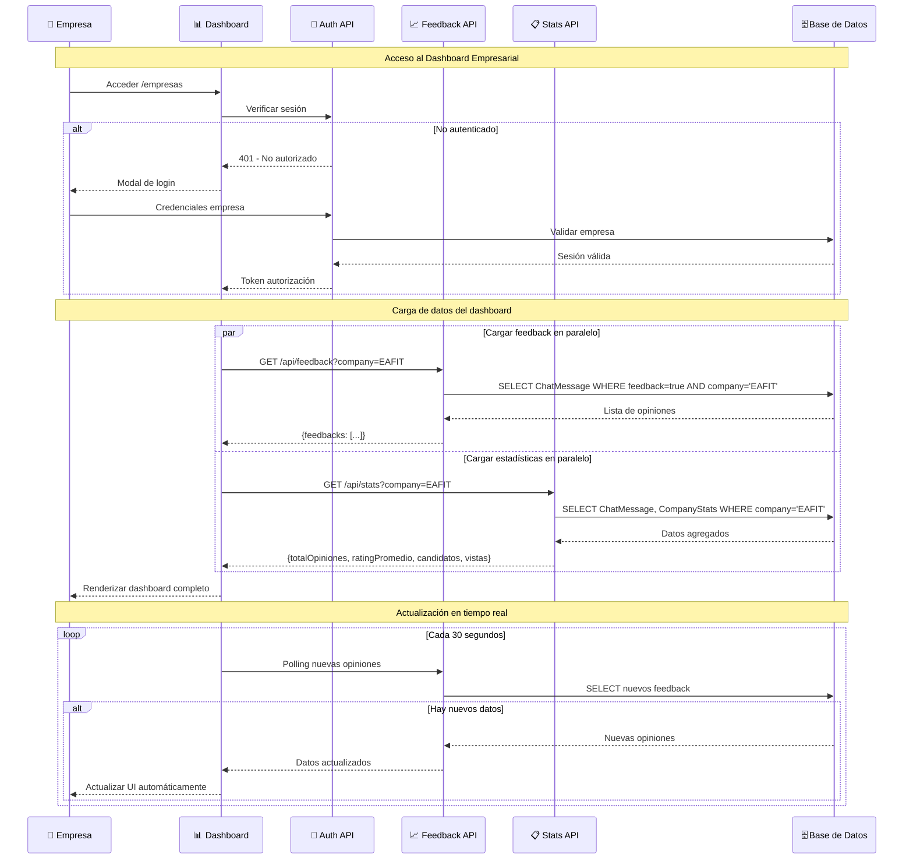

---

## 3. Diagramas de Estados

### 3.1 Estados del Usuario en el Sistema

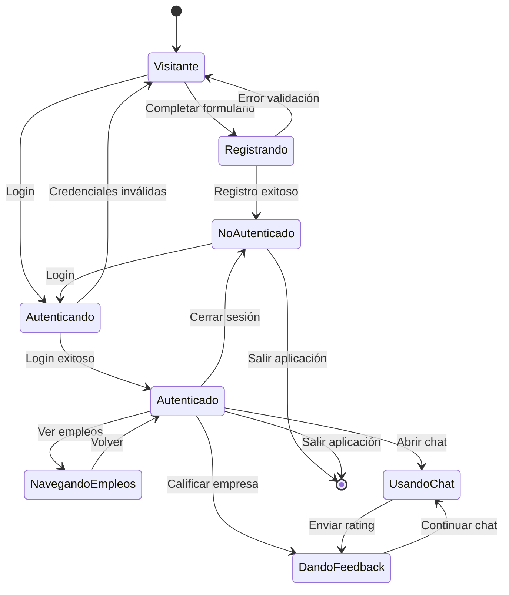

### 3.2 Estados del Chat y Mensajes

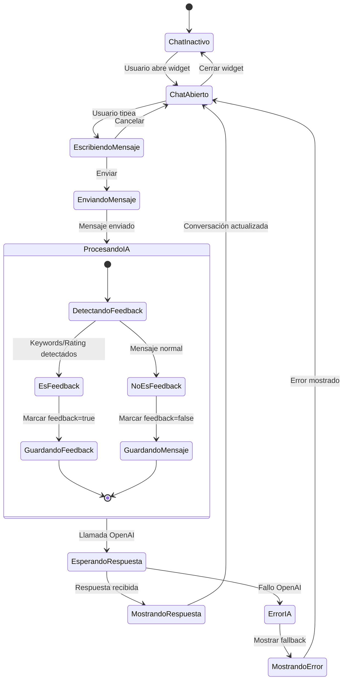

### 3.3 Estados del Dashboard Empresarial

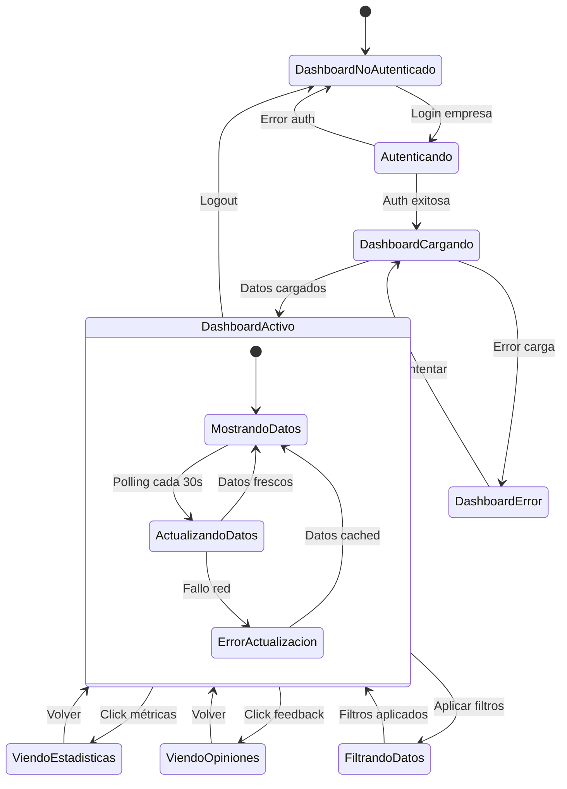

---

## 4. Diagrama de Actividades

### 4.1 Proceso Completo: Usuario Busca Empleo y Da Feedback

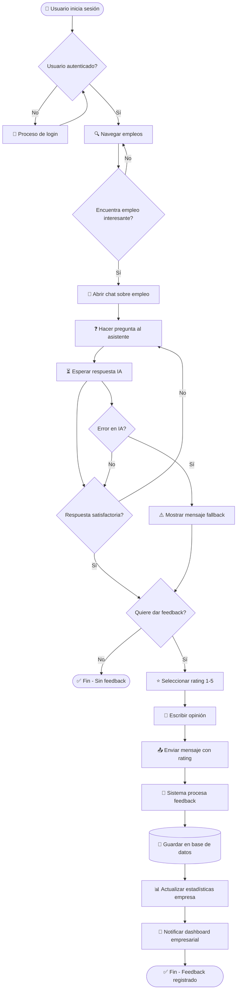

### 4.2 Proceso Empresarial: Monitoreo de Feedback

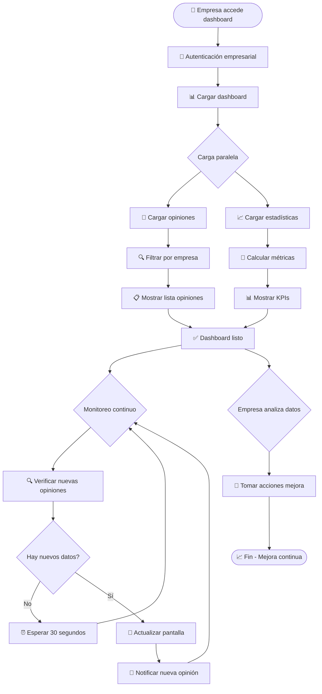

---

## 5. Diagrama de Componentes (Arquitectura Dinámica)

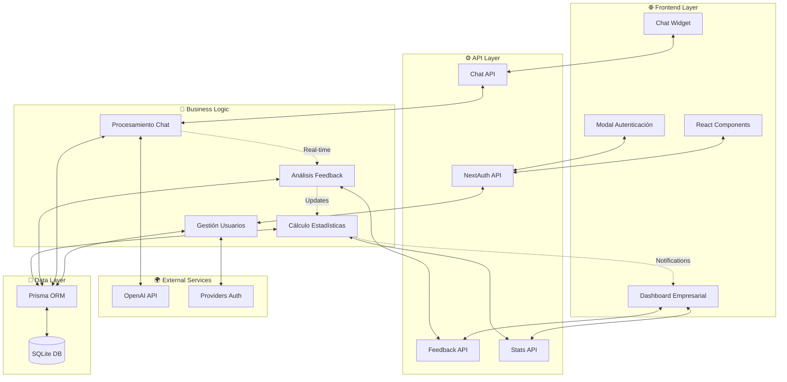

---

## 6. Patrones de Interacción

### 6.1 Patrón Observer (Dashboard en Tiempo Real)

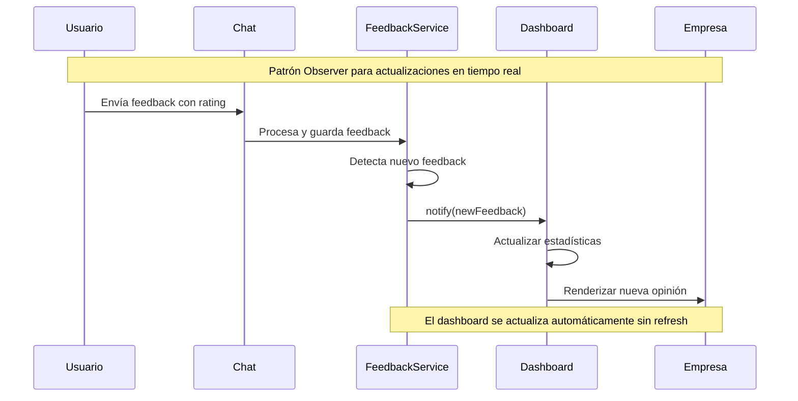

### 6.2 Patrón Request-Response con Fallback

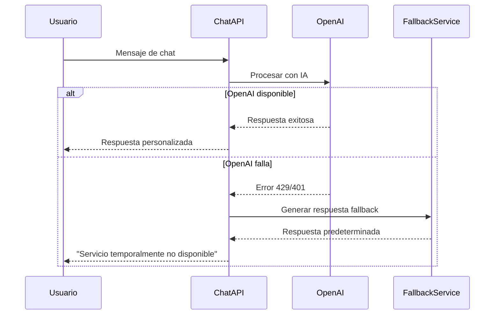

---

## 7. Métricas de Comportamiento

### Tiempos de Respuesta Esperados:
- **Autenticación**: < 2 segundos
- **Chat con IA**: < 5 segundos  
- **Carga Dashboard**: < 3 segundos
- **Actualización tiempo real**: < 1 segundo

### Flujos Críticos:
1. **Registro → Login → Chat → Feedback**: Flujo principal usuario
2. **Dashboard → Monitoreo → Análisis**: Flujo principal empresa
3. **Error Handling**: Todos los puntos de falla tienen recuperación

### Puntos de Integración:
- **NextAuth ↔ Prisma**: Gestión sesiones
- **Chat API ↔ OpenAI**: Procesamiento IA
- **Feedback → Stats**: Actualización métricas
- **Frontend ↔ API**: Comunicación REST

Este modelo de comportamiento demuestra la robustez y escalabilidad del sistema MiniMagneto en sus interacciones dinámicas.