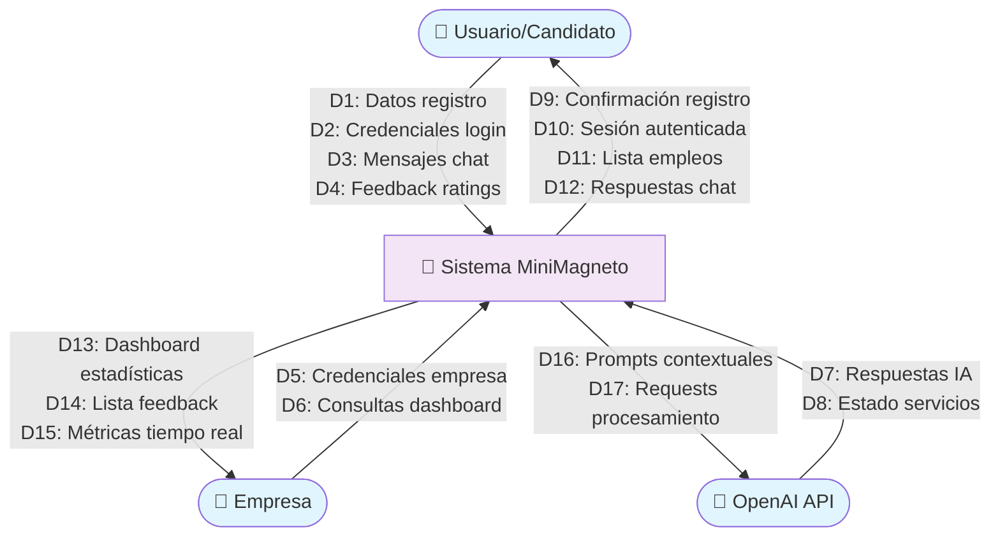
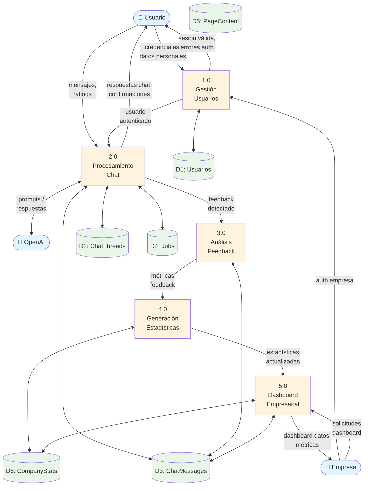
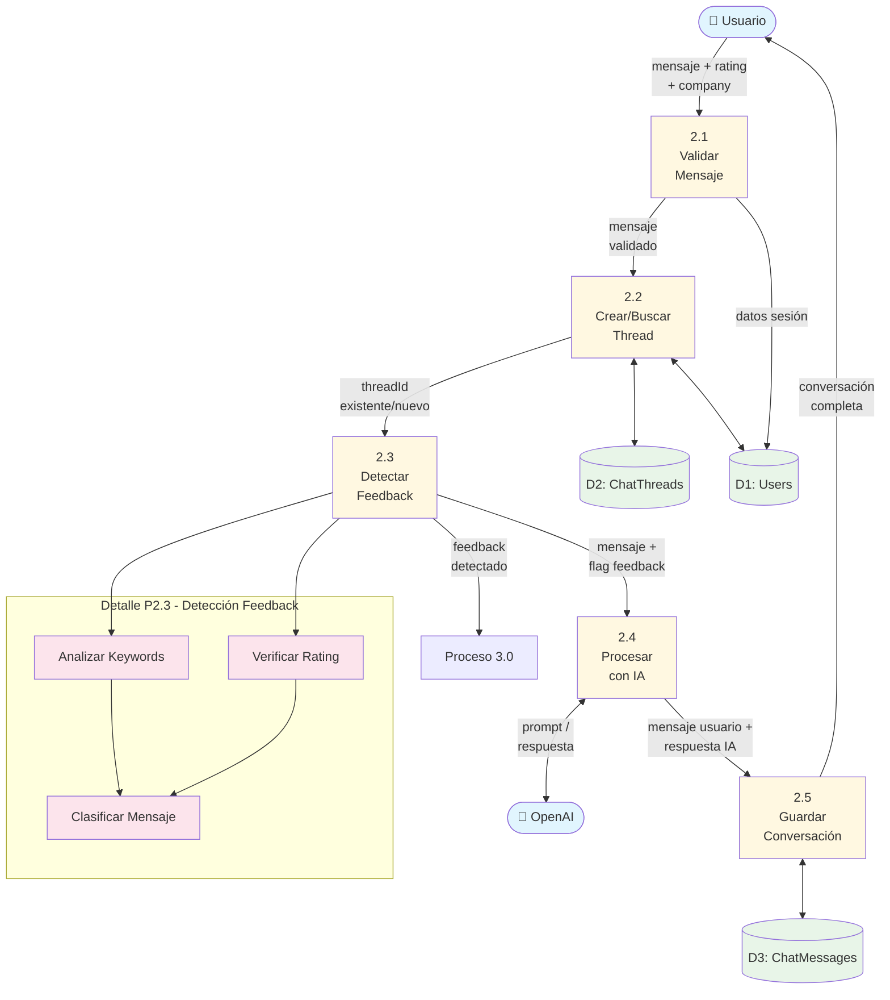
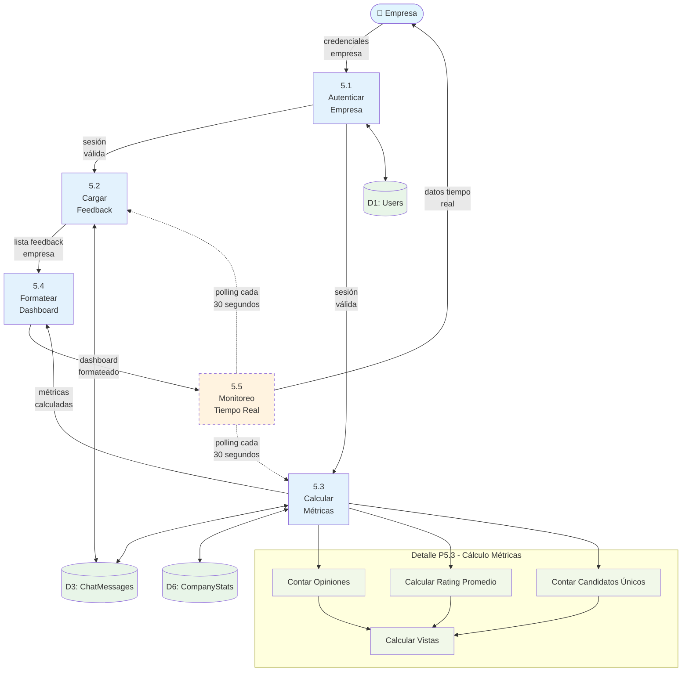
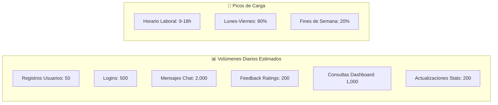
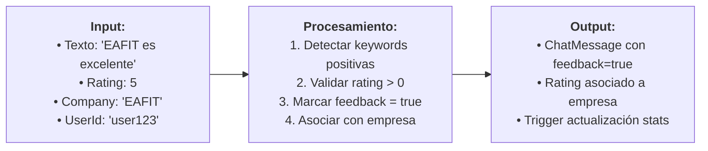
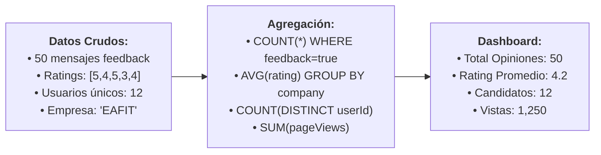
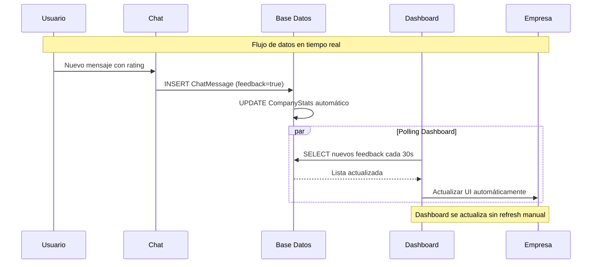

# Diagramas de Flujo de Datos (DFD)
## Sistema MiniMagneto

### Introducción
Los Diagramas de Flujo de Datos (Data Flow Diagrams) muestran cómo la información se mueve a través del sistema MiniMagneto, desde su entrada hasta su almacenamiento y procesamiento.

---

## DFD Nivel 0 - Diagrama de Contexto

---

## DFD Nivel 1 - Procesos Principales

---

## DFD Nivel 2 - Detalle del Procesamiento de Chat

---

## DFD Nivel 2 - Detalle del Dashboard Empresarial

---

## Matriz de Flujos de Datos

### Tabla de Flujos Principales

| ID | Nombre | Origen | Destino | Descripción | Frecuencia |
|----|--------|--------|---------|-------------|------------|
| D1 | Datos Registro | Usuario | P1.0 Gestión Usuarios | Email, password, nombre | Baja |
| D2 | Credenciales Login | Usuario | P1.0 Gestión Usuarios | Email, password para auth | Alta |
| D3 | Mensajes Chat | Usuario | P2.0 Procesamiento Chat | Texto, rating, company | Muy Alta |
| D4 | Feedback Ratings | Usuario | P2.0 Procesamiento Chat | Rating 1-5 + opinión | Media |
| D5 | Auth Empresa | Empresa | P1.0 Gestión Usuarios | Credenciales empresariales | Media |
| D6 | Consultas Dashboard | Empresa | P5.0 Dashboard | Solicitudes de datos | Alta |
| D7 | Respuestas IA | OpenAI | P2.0 Procesamiento Chat | Texto respuesta generada | Muy Alta |
| D8 | Estado Servicios | OpenAI | P2.0 Procesamiento Chat | Códigos error, disponibilidad | Baja |
| D9 | Confirmación Registro | P1.0 | Usuario | Éxito/error registro | Baja |
| D10 | Sesión Autenticada | P1.0 | Usuario | Token JWT, datos sesión | Alta |
| D11 | Lista Empleos | P2.0 | Usuario | Empleos filtrados por empresa | Media |
| D12 | Respuestas Chat | P2.0 | Usuario | Conversación completa | Muy Alta |
| D13 | Dashboard Estadísticas | P5.0 | Empresa | KPIs, métricas agregadas | Alta |
| D14 | Lista Feedback | P5.0 | Empresa | Opiniones de candidatos | Alta |
| D15 | Métricas Tiempo Real | P5.0 | Empresa | Actualizaciones live | Muy Alta |
| D16 | Prompts Contextuales | P2.0 | OpenAI | Contexto para IA | Muy Alta |
| D17 | Requests Procesamiento | P2.0 | OpenAI | Solicitudes de completado | Muy Alta |

### Volúmenes de Datos Estimados

---

## Análisis de Transformaciones de Datos

### 1. Transformación de Mensajes a Feedback

### 2. Transformación de Datos a Estadísticas

### 3. Flujo de Datos en Tiempo Real

---

## Diccionario de Datos

### Elementos de Datos Principales

| Elemento | Tipo | Formato | Rango/Validación | Descripción |
|----------|------|---------|------------------|-------------|
| userId | String | UUID v4 | 36 caracteres | Identificador único usuario |
| email | String | Email RFC | 5-100 caracteres | Email válido único |
| password | String | Hash bcrypt | 60 caracteres fijos | Password hasheado |
| threadId | String | UUID v4 | 36 caracteres | Identificador conversación |
| messageText | Text | UTF-8 | 1-2000 caracteres | Contenido mensaje |
| rating | Integer | Numérico | 1-5 | Calificación usuario |
| company | String | Alfanumérico | 2-50 caracteres | Nombre empresa |
| feedback | Boolean | true/false | 0 o 1 | Flag es feedback |
| createdAt | DateTime | ISO 8601 | Timestamp válido | Fecha creación |
| ratingPromedio | Float | Decimal | 1.0-5.0 | Rating calculado |

### Flujos de Transformación de Datos

1. **Password → Hash**: bcrypt(password, 12) → passwordHash
2. **Message → Feedback**: keywords + rating → feedback flag
3. **Individual Ratings → Average**: SUM(ratings)/COUNT(*) → ratingPromedio
4. **Raw Messages → Dashboard**: GROUP BY company → estadísticas agregadas

Este análisis de flujo de datos demuestra cómo la información se procesa eficientemente a través del sistema MiniMagneto, desde la entrada del usuario hasta las métricas empresariales.