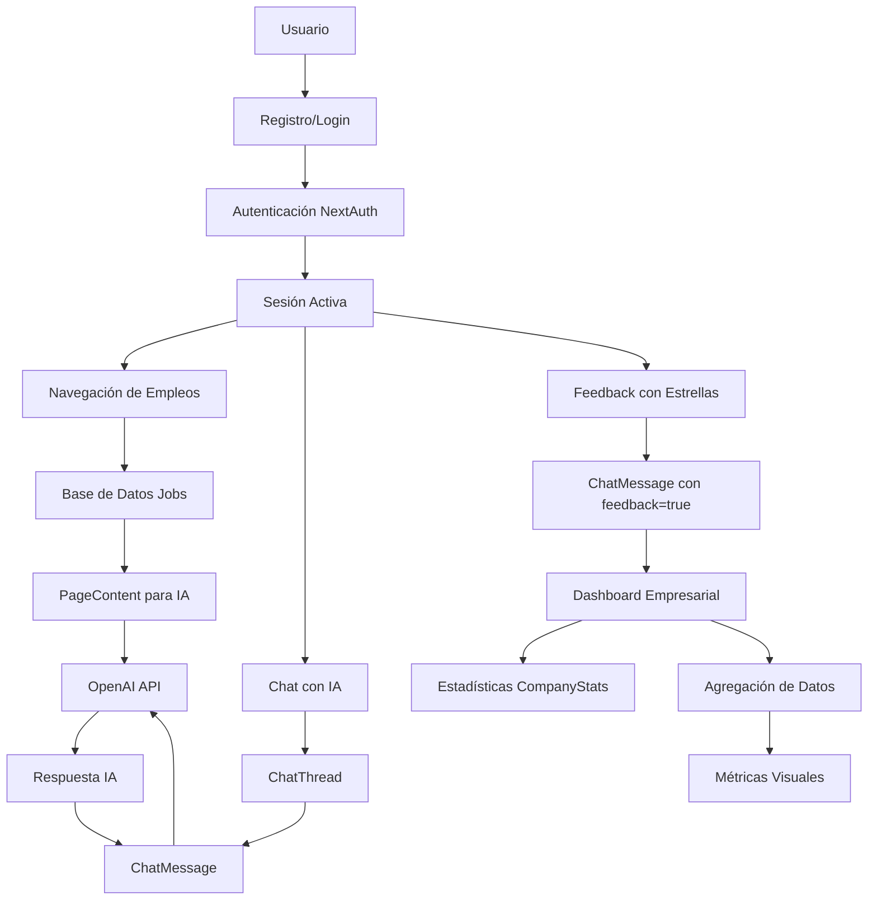

```mermaid
erDiagram
    User {
        string id PK "CUID"
        string name "Nullable"
        string email UK "Unique, Required"
        string passwordHash "Required"
        string image "Nullable"
        datetime createdAt "Default NOW"
        datetime updatedAt "Auto Update"
    }
    
    Job {
        string id PK "CUID"
        string title "Required"
        string company "Required"
        string location "Nullable"
        string description "Required"
        datetime createdAt "Default NOW"
        datetime updatedAt "Auto Update"
    }
    
    ChatThread {
        string id PK "CUID"
        string userId FK "Nullable"
        string jobId FK "Nullable"
        string title "Nullable"
        datetime createdAt "Default NOW"
    }
    
    ChatMessage {
        string id PK "CUID"
        string threadId FK "Required"
        string sender "user|bot"
        string text "Required"
        datetime createdAt "Default NOW"
        boolean feedback "Default FALSE"
        int rating "1-5, Nullable"
        string company "Nullable"
    }
    
    PageContent {
        string id PK "CUID"
        string source "Required"
        string url "Required"
        string title "Nullable"
        string content "Required"
        datetime createdAt "Default NOW"
    }
    
    CompanyStats {
        string id PK "CUID"
        string company UK "Unique, Required"
        int candidatesActive "Required"
        int companyViews "Required"
        datetime updatedAt "Auto Update"
    }

    %% Relaciones
    User ||--o{ ChatThread : "puede tener"
    Job ||--o{ ChatThread : "puede estar relacionado"
    ChatThread ||--}{ ChatMessage : "contiene"
    
    %% Relaciones implícitas (por campo company)
    Job }o--|| CompanyStats : "company field"
    ChatMessage }o--|| CompanyStats : "company field"
```

## Diagrama de Flujo de Datos



## Arquitectura de Capas

```mermaid
graph TB
    subgraph "Presentación"
        UI[Next.js Frontend]
        Dashboard[Dashboard Empresarial]
        Chat[Chat Widget]
    end
    
    subgraph "API Layer"
        Auth[/api/auth NextAuth]
        ChatAPI[/api/chat]
        JobsAPI[/api/jobs]
        FeedbackAPI[/api/feedback]
        StatsAPI[/api/stats]
    end
    
    subgraph "Business Logic"
        UserMgmt[Gestión Usuarios]
        ChatMgmt[Gestión Chat]
        JobMgmt[Gestión Empleos]
        FeedbackMgmt[Gestión Feedback]
    end
    
    subgraph "Data Access"
        Prisma[Prisma ORM]
    end
    
    subgraph "Persistencia"
        SQLite[(SQLite Database)]
    end
    
    subgraph "External Services"
        OpenAI[OpenAI API]
    end
    
    UI --> Auth
    UI --> ChatAPI
    UI --> JobsAPI
    Dashboard --> FeedbackAPI
    Dashboard --> StatsAPI
    Chat --> ChatAPI
    
    Auth --> UserMgmt
    ChatAPI --> ChatMgmt
    JobsAPI --> JobMgmt
    FeedbackAPI --> FeedbackMgmt
    StatsAPI --> FeedbackMgmt
    
    UserMgmt --> Prisma
    ChatMgmt --> Prisma
    JobMgmt --> Prisma
    FeedbackMgmt --> Prisma
    
    Prisma --> SQLite
    
    ChatMgmt --> OpenAI
```